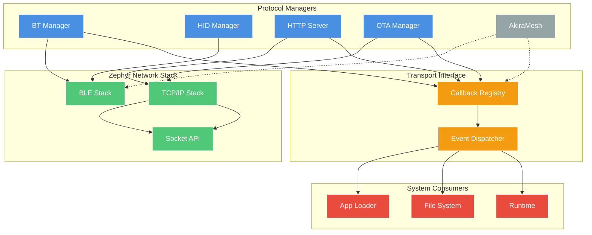
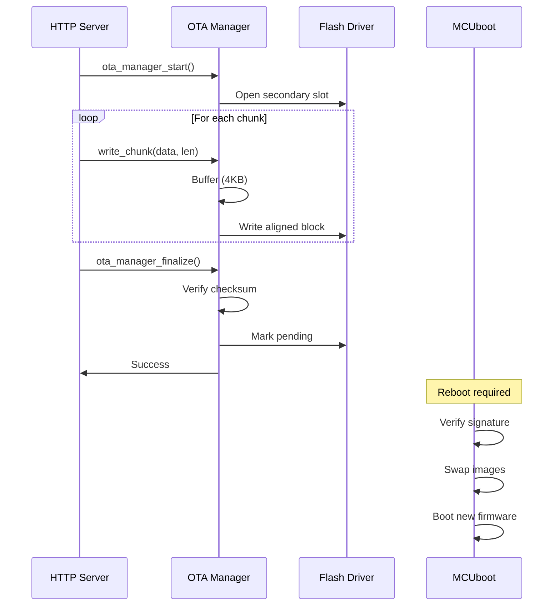

# Connectivity Layer

Modular connectivity subsystem for WiFi, Bluetooth, USB, and OTA operations with a pluggable transport interface.

## Architecture

The connectivity layer provides protocol managers (HTTP, Bluetooth, OTA) that route data to system consumers (Runtime, File System, App Loader) via a callback-based transport interface.

**Key Features:**
- Transport interface for pluggable consumers
- Reduced data copies (2 instead of 4 for OTA)
- Lower stack usage (4 KB instead of 9 KB total)
- Transports decoupled from consumers via callbacks



## Components

### Transport Interface

Lightweight callback registry for decoupling transport protocols from data consumers.

**API:**
```c
typedef void (*transport_data_cb_t)(const uint8_t *data, size_t len, void *ctx);

int transport_register_handler(enum data_type type, 
                               transport_data_cb_t callback, 
                               void *context);

int transport_notify(enum data_type type, 
                    const uint8_t *data, 
                    size_t len);
```

**Data Types:**
- `DATA_TYPE_WASM_APP` - WebAssembly application
- `DATA_TYPE_FIRMWARE` - OTA firmware update
- `DATA_TYPE_FILE` - Generic file
- `DATA_TYPE_CONFIG` - Configuration data

**Implementation:** Simple array-based registry with O(1) callback lookup.

### HTTP Server

HTTP/1.1 server for file uploads and OTA endpoints.

**Endpoints:**
- `POST /upload` - Multipart file upload to filesystem
- `POST /ota/upload` - Firmware upload to OTA Manager
- `GET /status` - System status JSON

**Configuration:**
- Thread stack: 4KB (improved from 6KB)
- Max connections: 1 (sequential)
- Buffer size: 1.5KB shared pool

**Performance:** ~1.3 MB/s upload throughput

### Bluetooth Manager

BLE stack initialization and connection management.

**State Machine:**
```
UNINITIALIZED → READY → ADVERTISING → CONNECTED
```

**Features:**
- Connection callbacks with reference counting
- Auto-reconnect on disconnect
- GATT service registration
- Thread-safe state management

### HID Manager

Bluetooth HID device support for input peripherals.

**Supported Devices:**
- Keyboard (standard HID keyboard report)
- Mouse (relative/absolute positioning)
- Gamepad (button + axis mapping)

**Architecture:**
- Registers as GATT service via BT Manager
- Implements HID Report Protocol
- Event-based input delivery to Runtime

### OTA Manager

Firmware update orchestration with MCUboot integration.

**Update Flow:**


**Characteristics:**
- Direct flash writes (no message queue overhead)
- 2 data copies (reduced from 4)
- <10 s completion time for 1.1 MB firmware
- Configurable socket receive timeout (no hard 120 s limit)

### App Loader

Receives WASM applications from network transports.

**Data Sources:**
- HTTP multipart upload
- Bluetooth file transfer
- AkiraMesh distribution (future)

**Flow:**
```
Transport → Callback → App Loader → File System → Runtime (chunked)
```

---

### BLE App Transfer Protocol

The BLE App Transfer service (`src/connectivity/bluetooth/bt_app_transfer.c`) is a system-level GATT service that lets a BLE peer install a WASM application wirelessly without a USB cable or network connection. It is always active when Bluetooth is initialized.

**Service Characteristics:**

| Characteristic | UUID | Access | Purpose |
|----------------|------|--------|---------|
| `RX_DATA` | custom | Write without response | Receives raw WASM data chunks |
| `TX_STATUS` | custom | Notify | Status updates to the BLE peer |
| `CONTROL` | custom | Write | Transfer control commands |

**State machine:**

```
IDLE ──(CMD_START)──► RECEIVING ──(CMD_COMMIT)──► VALIDATING ──► INSTALLING ──► COMPLETE
  ▲                       │                             │              │
  └──────────(CMD_ABORT)──┘                         CRC fail       Install fail
                                                        │              │
                                                        └──────────────► ERROR
```

**Control commands** (written to the `CONTROL` characteristic):

| Value | Constant | Description |
|-------|----------|-------------|
| `0x01` | `CMD_START` | Begin a new transfer. Payload: `name[32] + total_size[4] + expected_crc32[4]` (40 bytes) |
| `0x02` | `CMD_ABORT` | Cancel the current transfer and discard buffered data |
| `0x03` | `CMD_COMMIT` | Finalize transfer; triggers CRC32 validation and installation |
| `0x04` | `CMD_STATUS` | Request an immediate status notification |

**Status codes** (notified via `TX_STATUS`):

| Value | Constant | Description |
|-------|----------|-------------|
| `0x00` | `STATUS_OK` | Success / ready |
| `0x01` | `STATUS_ERROR` | General error |
| `0x02` | `STATUS_BUSY` | Transfer already in progress |
| `0x03` | `STATUS_CRC_FAIL` | CRC32 mismatch — data corrupted |
| `0x04` | `STATUS_SIZE_ERROR` | Received bytes ≠ declared total size |
| `0x05` | `STATUS_INSTALL_FAIL` | App manager rejected the WASM binary |
| `0x06` | `STATUS_NO_SPACE` | Not enough flash space |

**Transfer flow (client-side pseudocode):**

```python
# 1. Send START with header
header = name_bytes(32) + struct.pack("<II", total_size, crc32(wasm_data))
write_characteristic(CONTROL, bytes([0x01]) + header)

# 2. Stream chunks via RX_DATA (no response needed)
CHUNK = 244  # BLE 5.0 MTU minus ATT overhead
for offset in range(0, len(wasm_data), CHUNK):
    write_without_response(RX_DATA, wasm_data[offset:offset+CHUNK])

# 3. Commit — triggers validation + installation
write_characteristic(CONTROL, bytes([0x03]))

# 4. Wait for STATUS_OK notification
status = await_notify(TX_STATUS)
assert status == 0x00
```

**Querying transfer progress** (native C only — not exposed to WASM):

```c
#include "bt_app_transfer.h"

struct bt_app_xfer_progress p;
bt_app_transfer_get_progress(&p);
printf("State: %d, received %u / %u bytes (%u%%)",
       p.state, p.received_bytes, p.total_size, p.percent_complete);
```

> **Note:** This service is a system-level feature. WASM apps cannot initiate or observe BLE transfer sessions directly. Use `app_get_status()` from the Lifecycle API to check whether a newly-transferred app has been installed.

---

### CoAP Client

The CoAP client (`src/connectivity/client/coap_client.c`) is a native-side protocol implementation designed for IoT cloud integration and LwM2M targets. It supports Confirmable (CON) and Non-Confirmable (NON) message types, block transfer for large payloads, and CoAP Observe for server-push notifications.

> **Note:** CoAP is a native-C facility used by system services and the Cloud Client wrapper. WASM apps use the [Network API](../../AkiraSDK/docs/API_REFERENCE.md#network-api) for TCP/UDP. If you need CoAP from a WASM app, connect over a raw UDP socket.

**Supported Methods:** `GET`, `POST`, `PUT`, `DELETE`

**Content Formats** (select via `coap_content_format_t`):

| Constant | Value | Description |
|----------|-------|-------------|
| `COAP_FORMAT_TEXT_PLAIN` | 0 | Plain text |
| `COAP_FORMAT_JSON` | 50 | JSON |
| `COAP_FORMAT_CBOR` | 60 | CBOR |
| `COAP_FORMAT_SENML_JSON` | 110 | SenML+JSON |
| `COAP_FORMAT_SENML_CBOR` | 112 | SenML+CBOR |

**Basic request API:**

```c
#include "coap_client.h"

// Initialize once at system start
coap_client_init();

// GET a resource
coap_response_t resp;
int rc = coap_client_get("coap://192.168.1.10/sensors/temp", &resp);
if (rc == 0 && resp.code == COAP_CODE_CONTENT) {
    printf("Data: %.*s\n", (int)resp.payload_len, resp.payload);
    coap_client_free_response(&resp);
}

// POST sensor data as JSON
const char *payload = "{\"temp\":23.5}";
coap_client_post("coap://iot.example.com/data",
                 (uint8_t *)payload, strlen(payload),
                 COAP_FORMAT_JSON, &resp);
coap_client_free_response(&resp);
```

**Advanced — full request builder:**

```c
coap_request_t req = {
    .url         = "coap://192.168.1.10/actuator/led",
    .method      = COAP_METHOD_PUT,
    .type        = COAP_TYPE_CON,       // Confirmable — retransmit until ACK
    .format      = COAP_FORMAT_CBOR,
    .payload     = cbor_buf,
    .payload_len = cbor_len,
    .timeout_ms  = 5000,
};
coap_response_t resp;
coap_client_request(&req, &resp);
```

**Observe (server-push notifications):**

```c
// Subscribe to a resource — callback fires on each update
coap_observe_handle_t h = coap_client_observe(
    "coap://iot.example.com/alerts",
    on_alert_received,   // coap_observe_cb_t
    NULL);

// ... later, to unsubscribe:
coap_client_observe_stop(h);
```

**Block transfer for large resources:**

```c
// Download a file > 1 KB automatically split into Block2 transfers
uint8_t buf[8192];
size_t received;
coap_client_download("coap://server/firmware/ota.bin",
                     buf, sizeof(buf), &received);

// Upload large payload with Block1 transfers
coap_client_upload("coap://server/models/nn.cbor",
                   model_data, model_len,
                   COAP_FORMAT_CBOR);
```

**Limits (compile-time constants):**

| Constant | Value | Description |
|----------|-------|-------------|
| `COAP_CLIENT_MAX_URL_LEN` | 256 | Max URL length |
| `COAP_CLIENT_MAX_PAYLOAD` | 1024 | Max single-message payload |
| `COAP_CLIENT_MAX_OPTIONS` | 16 | Max CoAP options per message |

---

### USB Subsystem

Provides physical data-linking alongside network pathways using the native Zephyr USB device framework (`src/connectivity/usb/`).

**Configurations:**
- Mass Storage endpoints. 
- General UART-CDC (Console mapping).
- **USB HID Configuration:** Implements equivalent keyboard, mouse, and gamepad endpoints as the Bluetooth HID subsystem, directly piping into `akira_hid_api.c`.

### Cloud Client

Unified REST/MQTT client wrapper designed for telemetry logging and remote OTA polling (`src/connectivity/cloud/`). Enabled via `CONFIG_AKIRA_CLOUD_CLIENT=y`.

**Features:**
- Telemetry ingestion from WASM space.
- Fleet-checking endpoints for Firmware Version verification.

### Internal Buffer Pool (`buf_pool.c`)

A dynamic, non-fragmenting memory management backend explicitly coupled to the Transport Interface.
- Standardizes pre-allocated chunking (`1.5KB` slices) for UART/TCP streams heavily avoiding heap fragmentation.
- Binds direct payload addresses into `transport_notify()` pipelines.

### AkiraMesh (Planned)

Low-latency mesh networking for inter-device communication.

**Planned Features:**
- BLE Mesh or custom protocol
- Multi-hop routing
- WASM app distribution across mesh
- Low-power sensor network support

**Status:** Planned

## Data Flow

### File Upload (HTTP → FS)
```
1. HTTP recv() → 1.5KB buffer
2. Parse multipart boundary
3. Extract file data
4. fs_write() → LittleFS → Flash
```
**Copies:** 2 (network buffer → HTTP buffer → FS write buffer)

### Firmware Upload (HTTP → OTA)
```
1. HTTP recv() → 1.5KB buffer
2. Direct callback to OTA Manager
3. Write to 4KB alignment buffer
4. Flush to flash when aligned
```
**Copies:** 2 (network → HTTP → flash buffer → flash)

## Performance Characteristics

| Operation | Throughput | Latency | Stack | Memory |
|-----------|------------|---------|-------|--------|
| HTTP Upload | ~1.3 MB/s | N/A | 4KB | 1.5KB |
| OTA Flash Write | ~200 KB/s | 10-20ms | 4KB | 4KB |
| BLE Transfer | ~10 KB/s | <10ms | 6KB | MTU (244B) |
| HID Report | N/A | <5ms | - | 64B |

## Thread Model

| Thread | Stack | Priority | Blocking |
|--------|-------|----------|----------|
| HTTP Server | 4KB | 7 | Accept/recv |
| OTA Manager | 4KB | 6 | Flash writes |
| BT Manager | 6KB | 7 | BLE events |

## Configuration

**Kconfig Options:**
```
CONFIG_AKIRA_HTTP_SERVER=y
CONFIG_AKIRA_HTTP_PORT=80
CONFIG_AKIRA_OTA_MANAGER=y
CONFIG_AKIRA_BT_MANAGER=y
CONFIG_AKIRA_HID_MANAGER=y
```

## Design Principles

1. **Modularity** - Each protocol is self-contained
2. **Decoupling** - Transport interface separates protocols from consumers
3. **Thread Safety** - Mutex protection for shared state
4. **Performance** - Direct writes, minimal copies
5. **Simplicity** - Array-based registry, no complex dispatch tables

## Planned Improvements

- Zero-copy network streaming to PSRAM
- Shared network buffer pool
- Concurrent HTTP connections
- Static transport dispatch table
- AkiraMesh implementation

## Related Documentation

- [Architecture Overview](index.md)
- [Runtime Architecture](runtime.md)
- [Data Flow](data-flow.md)
- [OTA Updates Guide](../development/ota-updates.md)
